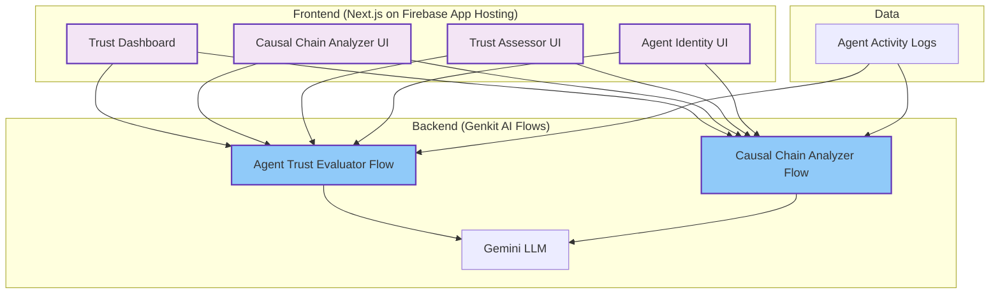
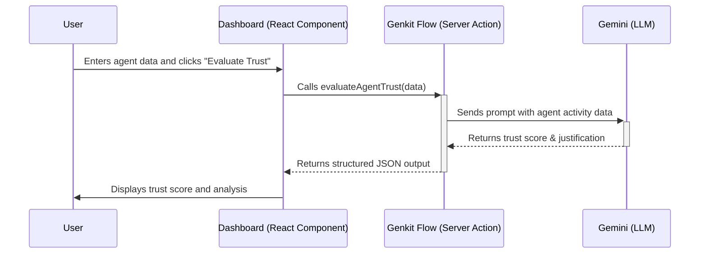

# TrustNet Guardian

TrustNet Guardian is an advanced security framework designed to fortify the Agentic Web against emerging logic-layer threats. It provides a real-time, AI-driven platform for assessing agent trustworthiness, analyzing behavior, and preemptively mitigating security risks like Logic-layer Prompt Control Injection (LPCI) attacks.

## Why TrustNet Guardian?

As autonomous AI agents become more prevalent, they introduce novel attack surfaces. Malicious actors can manipulate agent behavior through cleverly crafted prompts (LPCI attacks), turning them into unwitting accomplices for data exfiltration, system compromise, or unauthorized actions. Traditional security measures are often blind to these logic-layer threats.

TrustNet Guardian addresses this gap by moving beyond static defenses. It continuously monitors and evaluates agent behavior in real-time, creating a dynamic trust fabric that adapts to the evolving threat landscape.

## Core Features

-   **AI-Powered Trust Assessor**: Continuously analyzes agent behavior using AI to identify anomalies and potential security risks.
-   **Causal Chain Analyzer**: Employs generative AI to analyze sequences of agent actions, detecting patterns indicative of LPCI attacks.
-   **Trust Dashboard**: Displays real-time trust scores and detailed analytics on agent behavior.
-   **DID/VC Identity Management**: Manages agent identities using Decentralized Identifiers (DIDs) and Verifiable Credentials (VCs).
-   **Trust-Adaptive Runtime**: Dynamically adjusts agent permissions and environments based on real-time trust levels.

## Architecture

The system is built on a modern, serverless stack using Next.js for the frontend and Google's Genkit for the AI backend. Agent data is processed by AI flows to produce trust scores and analyses, which are then visualized in the dashboard.



## How It Works: A Sequence Diagram

This diagram illustrates the flow of an agent trust evaluation request.



## Getting Started

To run the TrustNet Guardian dashboard locally, follow these steps.

### Prerequisites

-   Node.js (v18 or later)
-   npm or yarn

### Installation & Setup

1.  **Clone the repository:**
    ```bash
    git clone <repository-url>
    cd <repository-directory>
    ```

2.  **Install dependencies:**
    ```bash
    npm install
    ```

3.  **Set up environment variables:**
    Create a `.env` file in the root of the project and add your Google AI API key:
    ```
    GOOGLE_API_KEY=your_google_ai_api_key_here
    ```

### Running the Application

The application consists of two main parts: the Next.js frontend and the Genkit AI flows. You'll need to run them in separate terminals.

1.  **Start the Genkit development server:**
    This server runs your AI flows and makes them available to the application.
    ```bash
    npm run genkit:watch
    ```

2.  **Start the Next.js development server:**
    In a new terminal, run:
    ```bash
    npm run dev
    ```

The application will now be running at `http://localhost:9002`.

## License

This project is licensed under the MIT License - see the [LICENSE.md](https://opensource.org/licenses/MIT) file for details.
